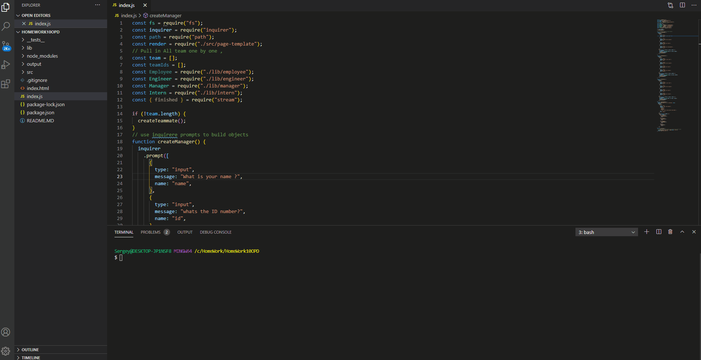

   <h1>Title Name: Team Profile Generator. </h1>
  
   ## Description : 
   
   Building a Node.js command-line application that takes in information about employees on a software engineering team, then generates an HTML webpage that displays summaries for each person.team's basic info,such as emails and GitHub profiles.

   <h3>## Content :

- [Description](#description)
- [Instruction](#instructions)
- [Usage](#usage)
- [Contributers](#contributers)
- [GitHub](#GitHub)
- [Email](#mail)
</h3>

## Instruction :

npm init npm inquirer

ask is to create a command-line application that dynamically generates software engineering team from a user's input using the Inquirer package.

## Usage :

The application will be invoked by using the following command:

```bash
node index.js
```

## Contributers : Sergey Ishimov

## GitHub Link : (https://github.com/Sergey-ddbug)

## GitHub Repo : (https://github.com/Sergey-ddbug/Team-Builder)

## Email : sishimov@gmail.com


## Quick Video :


